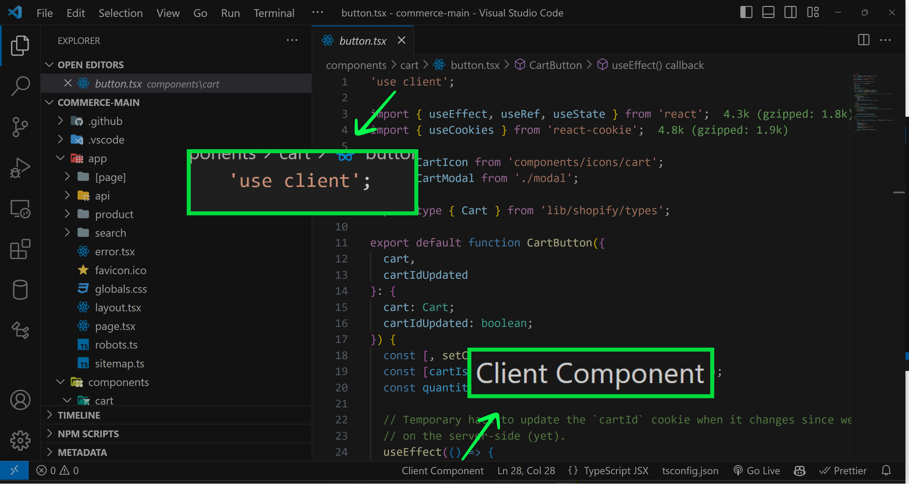

# Next.js App Router Component Helper - VS Code Extension

Knowing whether a component runs on the server or the client can get very confusing as your Next.js project grows.
This VS Code extension is designed to help developers working on Next.js projects identify whether a component is a server component or a client component inside the App router. 

All components are considered server components by default unless they contain the 'use client'; directive at the top of the file or are imported into another client component.

This extension ignores files inside the pages folder.
## Usage

1. Open your Next.js project in VS Code. The extension will automatically start scanning your project.
2. Wait for the initial scan to complete. An information message will inform you when the scan is complete.
3. Start working on a component file. The status bar will display whether the file is a client or server component.
4. Click the status bar item to trigger a manual scan (Useful when adding components to the project)

## Limitations

- As of the current version, this extension considers a file to be a "component" if it is a `.jsx` or `.tsx` file that has a default export. It does not consider `.js` or `.ts` files to be components.
- May not work on all import aliases.

## Contributing

Pull requests are welcome and encouraged! Thanks for checking out this project! 🎉

## License

[MIT](https://choosealicense.com/licenses/mit/)
